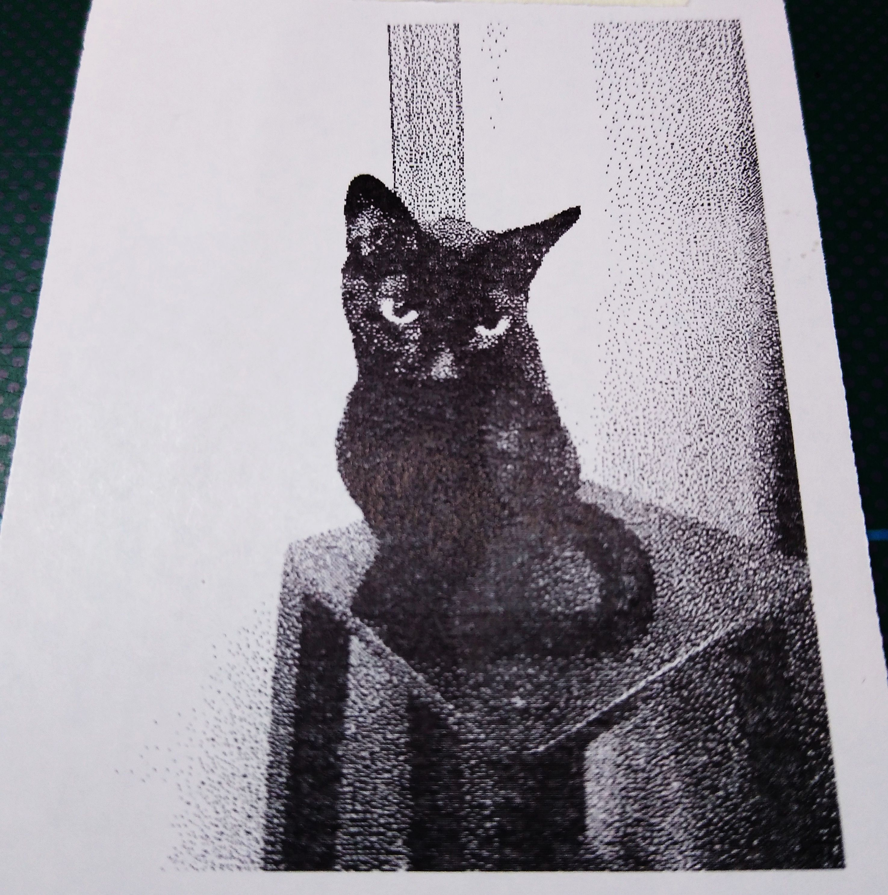

# Seismograph


Using [slinktool](https://github.com/iris-edu/slinktool) and the [SeedLink](http://ds.iris.edu/ds/nodes/dmc/services/seedlink/) protocol, I pull data supplied by the `rtserve.iris.washington.edu` server, from _Fort Macarthur Park, California, USA_ station "CI_FMP", channel "BHZ" [STS-2](https://streckeisen.swiss/en/products/sts-2/) seismometer:
```bash
slinktool -s BHZ.D -S CI_FMP rtserve.iris.washington.edu -p -u | ./thermal-printer.py -p '-2000 3000' > /dev/serial0
```
_Chusmiza, Chile_, [Nanometrics Trillium 240 Broadband Sensor](https://www.passcal.nmt.edu/content/instrumentation/sensors/broadband-sensors/t240-bb-sensor):
```bash
slinktool -s BHZ.D -S C_GO01 rtserve.iris.washington.edu -p -u | ./thermal-printer.py -p '-1000 1000' > /dev/serial0
```


# Barcodes


```bash
./thermal-printer.py -b 'ITF HN-VIGNOLLES ' > /dev/serial0
```

# Image Printing


```bash
./thermal-printer -i imagefile > /dev/serial0
```
```bash
# Another example:
qrencode "WIFI:S:<SSID>;T:WPA;P:<PASSWORD>;;" -o qr_wifi.png
./thermal-printer -i qr_wifi.png > /dev/serial0
```

# Hookup
```
R-Pi
─────┐
 1 2 │
 ■ ● │
 ● ● │      ┌──────────────
 ● ●─┼─GND──┤GND   TTL level
 ● ●─┼─TX───┤RX    Printer
 ● ●─┼─RX───┤TX 
     │
...  │   ┌────────────┐      ┌──────────────
     ├───┤ USB-to  GND├──────┤GND   RS-232
     │   │ RS-232   TX├──────┤RX    Printer
     │   │          RX├──────┤TX
     │   └────────────┘
```
<br>


# Notes
- My printer model: `JP-QR701-RS232`
- Power Supply for the printer: 5-9V, >=2A
  - The peak current consumption can reach 3.89A
  - I have tested the LM2596 module at 9v with good results
- Baud rate typically 9600 or 19200

## TCP/IP
Using `socat` and `nc`.

On the thermal-printer side (Raspberry Pi):
```bash
socat -gx TCP-LISTEN:3000,fork,max-children=10,reuseaddr OPEN:/dev/serial0
```
On the "client" side:
```bash
./thermal-printer.py [options] | nc <raspberrypi-ip> 3000
```

## Debugging serial data
```bash
./thermal-printer.py [options] 2> /dev/null | hexdump -e '52/1 "%02X "" "' -e '8/1 "%_p""\n"'
```